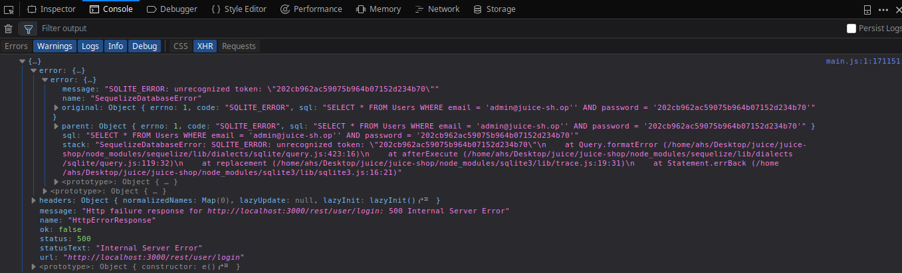
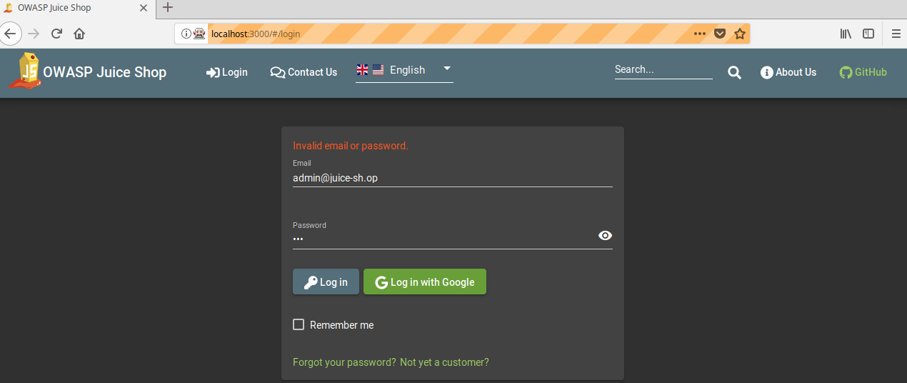
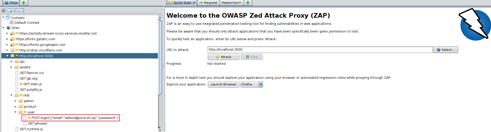
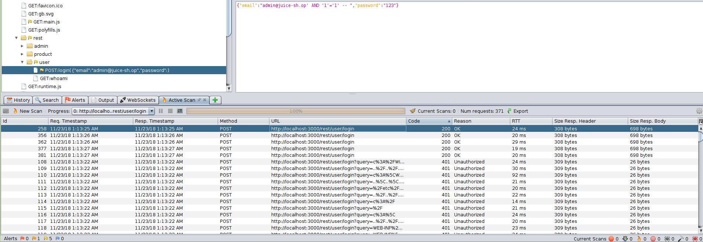
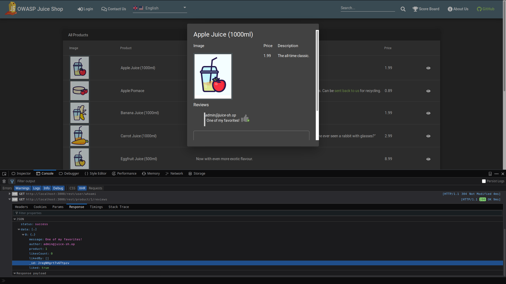
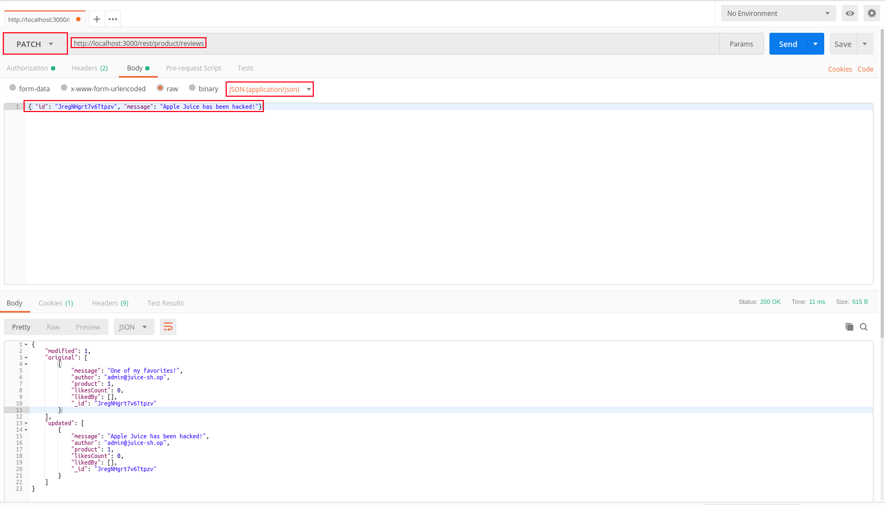
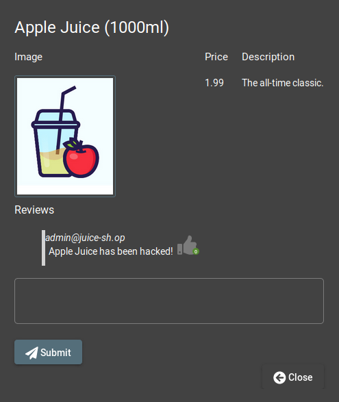
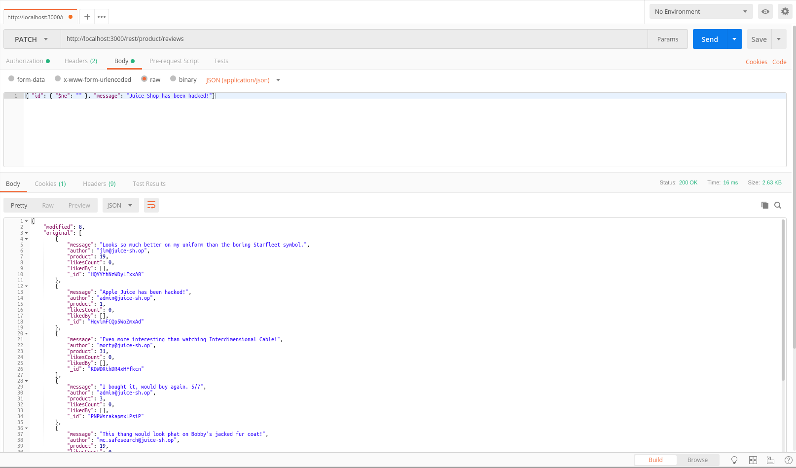
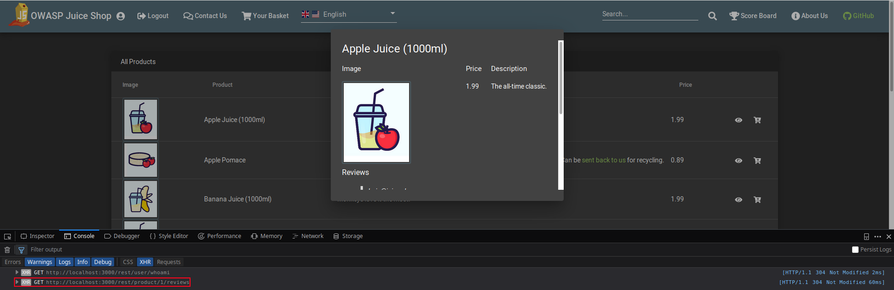
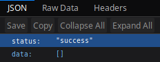

# Challenge Collection 2: Injection - Solutions

## Challenge 2.1: Log in as administrator

### Variant 1: Causing an internal server error by inserting invalid input

Provoke an error by crashing the application with the input `admin@juice-sh.op'` and any password.  

  

There occurs an error `[object Object]`. If you look at the console, you will recieve more information  
  

There you can recognize the underlying NoSQL-Query in the row `sql`: `SELECT * FROM Users WHERE email = 'admin@juice-sh.op'' AND password = '202cb962ac59075b964b07152d234b70'`. As a consequence of the two apostrophes following the email, the statement now is corrupted. The rest of the statement after the email can be commented out with two hyphen `--`. So, the password won't be compared with the entry in the database.  
  
With `admin@juice-sh.op'--` as input and any password, you can access the administrator's account.

### Variant 2: Scanning the juice shop with OWASP ZAP

[Install OWASP ZAP](https://github.com/zaproxy/zaproxy/wiki/Downloads).  
Open OWASP ZAP. In the field `URL to attack`, fill in the URL of Juice Shop and click the `Launch Browser`-Button.  
  

In this browser, you go to `http://localhost:3000/#/login` and attempt a login with the email of the admin. Type `admin@juice-sh.op` in the email field, a random input in the password field and click the `Log in` Button  
  
In this way, you cause a POST call on the REST API. Go back to OWASP ZAP and expand the `http://localhost:3000` folder in the `Sites` tab:  
  
You will see, that the last POST call is monitored there. Right click the POST call and choose `Attack` --> `Active Scan..`:  
  
Confirm the dialog with `Start Scan`:  
  

OWASP ZAP attempts to log in the application by changing several parameters in the POST call that you made before with your login attempt. In this case, the password has been replaced:  
  
As you can see, there are numerous attempts with the result `Unauthorized`. By sorting the `Code` or `Reason` column, a few calls with status `OK` are shown.  
  
You see the parameters that lead to a successful login: `admin@juice-sh.op' AND '1'='1' --` as email input and `123` as password input.

## Challenge 2.2: Modify a product review

Open the web development tool and select the tab `Console`.
Open the product information for `Apple Juice (1000 ml)`. You will receive the GET call `http://localhost:3000/rest/product/1/reviews`. Select the tab `Response` (Firefox) of the GET call to see the given parameters:
  

Open Postman and type `http://localhost:3000/rest/product/reviews` as link (note that you have to remove the `1` from the original GET call).
As you found out from the console, the id of the message you want to attack in this case is `JregNHgrt7v6Ttpzv`. So, this must appear in your body, as this is the only message you want to modify. Your body should look like this:
`{ "id": "JregNHgrt7v6Ttpzv", "message": "Apple Juice has been hacked!"}`. Check if you have chosen `JSON (application/json)` as type:

  
`Send` this as a PATCH call.
Opening the product information again shows the wanted comment:
  

## Challenge 2.3: Modify multiple product reviews at once

Similar to [Challenge 2.2](), you need to insert `http://localhost:3000/rest/product/reviews` in Postman.
You have to replace the old input for the `id` with `{ "$ne": "" }`, because `ne` is the `not equal` operator. As you want to update **all** product reviews, `ne=""` will match every time because there is no id with an empty string.
Adjust the message to `Juice Shop has been hacked!`, make sure you have selected `JSON (application/json)` and `Send` the PATCH call:

  

A look at several products shows that reviews from different users has changed to the wanted message:  

  
  

## Challenge 2.4: Cause the server of the juice shop to sleep for 2 seconds

Open any product information while observing the console of the web development tool. You see the GET call `http://localhost:3000/rest/product/1/reviews`, which holds an opportunity for injecting the sleep function:  

  

Call `http://localhost:3000/rest/product/sleep(2000)/reviews`. You see that the browser will load longer before showing this JSON response:  

