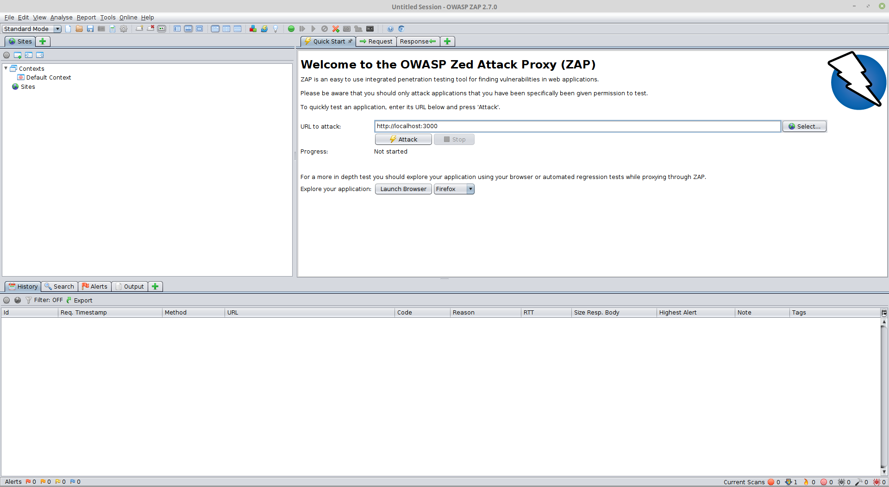
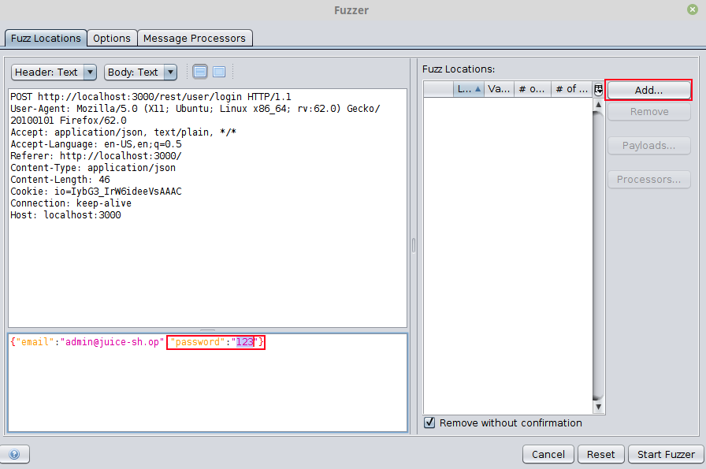
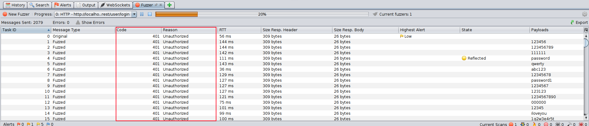
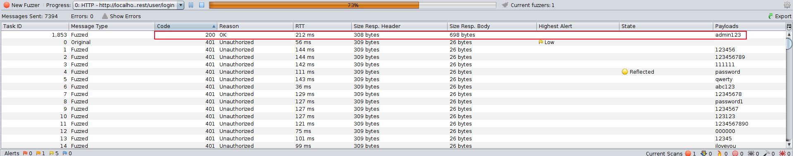

# Challenge Collection 3: Broken Authentication - Solutions

## Challenge 3.1: Log in with the original password of the administrator (without SQL injection or changing password)

[Install OWASP ZAP](https://github.com/zaproxy/zaproxy/wiki/Downloads).

Open OWASP ZAP. In the field `URL to attack`, fill in the URL of Juice Shop and click the `Launch Browser`-Button.  
  

In this browser, you go to http://localhost:3000/#/login and attempt a login with the email of the admin. Type `admin@juice-sh.op` in the email field, a random input in the password field and click the `Log in`-Button  
  

In this way, you cause a POST call on the REST API. Go back to OWASP ZAP and expand the `http://localhost:3000` folder in the `Sites` tab:  

  
You will see, that the last POST call is monitored there. Right click the POST call and choose `Attack` --> `Fuzz...`:  
  

In the window `Fuzzer`, mark the password (in this case `123`) that you have chosen for your login attempt as this is the parameter that should be replaced. In the area `Fuzz Locations:`, click on `Add...`:  
  

In the window "payloads", click again on `Add...`:  
  

In the window "Add Payload", change the `Type` to file, click at `Select...` and choose a wordlist from your local drive:  
  

For example, you can get the file `darkweb2017-top10000` from https://github.com/danielmiessler/SecLists/tree/master/Passwords:  
  

After adding the file, you can see a preview of the words in your textfile:  
  

Click on `Add` and confirm the `Payloads` window with `OK`.
Your `Fuzzer` window should look like this:  
  

Now, you are ready to click on `Start Fuzzer`.
While Fuzzering, you will receive lots of passwords that lead to the status `Unauthorized`:  
  

Sort after the column "Code" or `Reason` and you see a row with one `OK` result. The column `Payloads` presents the password for the email `admin@juice-sh.op`: `admin123`.  

