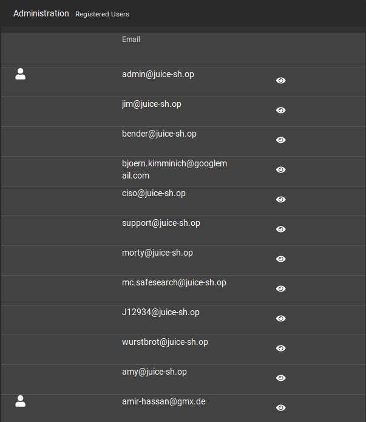
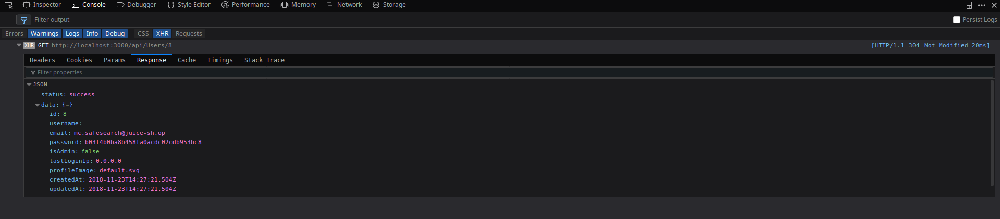
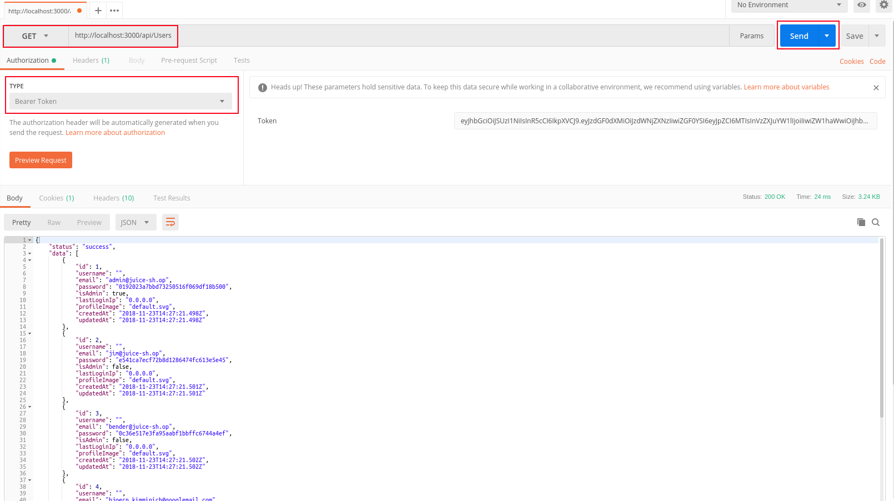

# Challenge Collection 4: Sensitive Data Exposure - Solutions

## Challenge 4.1: Log in with MC SafeSearch's original password (without SQL injection or changing password)

Log in with your own account or with the administrator's account (if you know his password or know how to perform SQL injection). Browse to the admin section: __

Click on the eye icon next to the email `mc.safesearch@juice-sh.op`.
Open the console of the web development tool. You see the GET call `http://localhost:3000/api/Users/8`. Expand this call and open the tab `Response` in their:

In the row password, the MD5 hash of the password is located: `b03f4b0ba8b458fa0acdc02cdb953bc8`
Convert this hash to plain text with a MD5 decrpyt website like https://www.md5online.org/

You receive `Mr. N00dles` as passwort for MC SafeSearch's account.

--

Now that you know the GET call for getting more user information, you have the opportunity to leak all user credentials. To do this, switch to the tab `Cookies` of the GET call.

Copy the token. You will need at for the authorization in Postman (if you haven't installed Postman yet, download [download!](https://www.getpostman.com/apps) it)

Open Postman. Insert `http://localhost:3000/api/Users` as GET call. Change the `TYPE` to `Bearer Token` and paste the token that you have copied before. Click on `Send`:

As result, all users of the juice shop are listed with their stored information including their password hashes.
