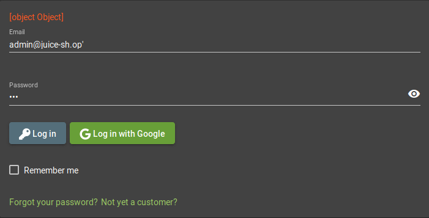

# Challenge Collection 2: Injection - Solutions

## Challenge 2.1: Log in as administrator

### Variant 1: Causing an internal server error by inserting invalid input

Provoke an error by crashing the application with the input "admin@juice-sh.op'" and any password.

Format: 

There occurs an error "[object Object]". If you look at the console, you will recieve more information

*2_1_2*

There you can recognize the underlying NoSQL-Query in the row "sql": "SELECT * FROM Users WHERE email = 'admin@juice-sh.op'' AND password = '202cb962ac59075b964b07152d234b70'". As a consequence of the two apostrophes following the email, the statement now is corrupted. The rest of the statement after the email can be commented out with two hyphen. So, the password won't be compared with the entry in the database.

*2_1_3*
With "admin@juice-sh.op'--" as input and any password, you can access the administrator's account.

### Variant 2: Scanning the juice shop with OWASP ZAP

Install OWASP ZAP: https://github.com/zaproxy/zaproxy/wiki/Downloads.
Open OWASP ZAP. In the field "URL to attack", fill in the URL of Juice Shop and click the "Launch Browser"-Button.
*2_1_4*

In this browser, you go to http://localhost:3000/#/login and attempt a login with the email of the admin. Type "admin@juice-sh.op" in the email field, a random input in the password field and click the "Log in"-Button
*2_1_5*
In this way, you cause a POST call on the REST API. Go back to OWASP ZAP and expand the "http://localhost:3000" folder in the "Sites" tab:

*2_1_6*
You will see, that the last POST call is monitored there. Right click the POST call and choose "Attack" --> "Active Scan...":
*2_1_7*
Confirm the dialog with "Start Scan":
*2_1_8*

OWASP ZAP attempts to log in the application by changing several parameters in the POST call that you made before with your login attempt. In this case, the password has been replaced:

*2_1_10*
As you can see, there are numerous attempts with the result "Unauthorized". By sorting the "Code" or "Reason" column, a few calls with status "OK" are shown.
*2_1_11*
In the "Request" tab, you see the parameters that lead to a successful login: "admin@juice-sh.op' AND '1'='1' -- " as email input and "123" as password input.

## Challenge 2.2: Cause the server of the juice shop to sleep

*TODO* 
