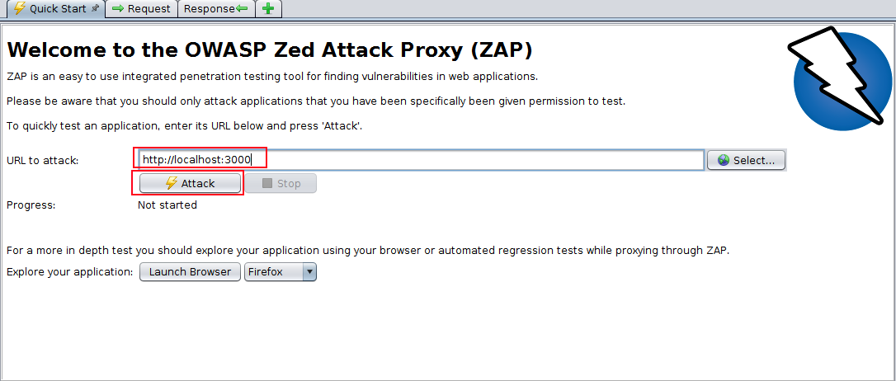
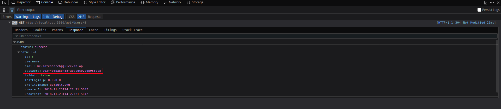
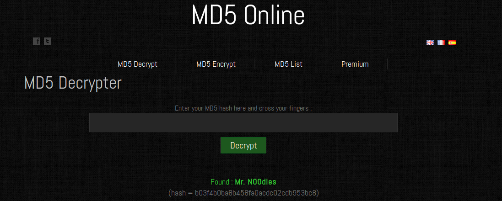
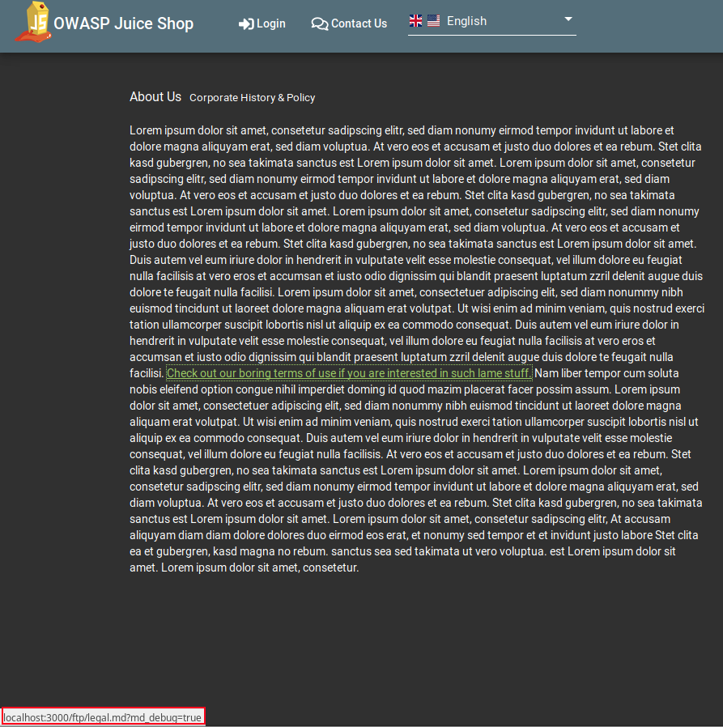

# Challenge Collection 4: Sensitive Data Exposure — Solutions

   * [Challenge 4.1: Log in with MC SafeSearch's original password (without SQL injection or changing password)](#challenge-41-log-in-with-mc-safesearchs-original-password-without-sql-injection-or-changing-password)
      * [Additional information:](#additional-information)
   * [Challenge 4.2: Find and open a confidential document](#challenge-42-find-and-open-a-confidential-document)
      * [Variant 1: Scanning the Juice Shop with OWASP ZAP](#variant-1-scanning-the-juice-shop-with-owasp-zap)
      * [Variant 2: Searching after security lacks in the user interface of the Juice Shop](#variant-2-searching-after-security-lacks-in-the-user-interface-of-the-juice-shop)

## Challenge 4.1: Log in with MC SafeSearch's original password (without SQL injection or changing password)

Log in with your own account or with the administrator's account (if you know his password or know how to perform SQL injection). Browse to the **admin section**:  

  
Click on the eye icon next to the email `mc.safesearch@juice-sh.op`.
Open the console of the **Web Development Tool**. You see the **GET** call `http://localhost:3000/api/Users/8`. Expand this call and open the tab `Response` in there:
  
In the row `password`, the **MD5 hash** of the password is located: `b03f4b0ba8b458fa0acdc02cdb953bc8`
Convert this hash to plain text with a **MD5 decrypt website** like https://www.md5online.org/
  
You receive `Mr. N00dles` as password for **MC SafeSearch's account**.

### Additional information:

Now that you know the **GET** call for getting more user information, you have the opportunity to leak all user credentials. To do this, switch to the tab `Cookies` of the **GET** call.  
  
Copy the token. You will need it for the authorization in [Postman](https://www.getpostman.com/apps).

Open **Postman**. Insert `http://localhost:3000/api/Users` as **GET** call. Change the `TYPE` to `Bearer Token` and paste the token that you have copied before. Click on `Send`:  
  

As result, all users of the juice shop are listed with their stored information including their password hashes.

## Challenge 4.2: Find and open a confidential document

### Variant 1: Scanning the Juice Shop with OWASP ZAP

Start [OWASP ZAP](https://github.com/zaproxy/zaproxy/wiki/Downloads), fill in `http://localhost:3000` in the `Quick Start` tab and click on `Attack`
  

The scan shows you an area of the **OWASP Juice Shop** you have never seen before: `http://localhost:3000/ftp`
  

Visit this site:
  
Open `acquisitions-md` to solve the challenge.

### Variant 2: Searching after security lacks in the user interface of the Juice Shop

Browse to the `About Us` section of the **OWASP Juice Shop**: http://localhost:3000/#/about  
You will see that there is a more or less hidden link:
  

If you hover over the link, the `ftp` section will be revealed.

