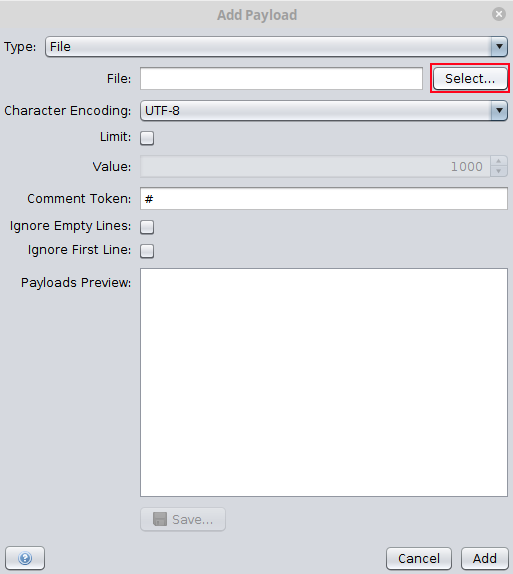
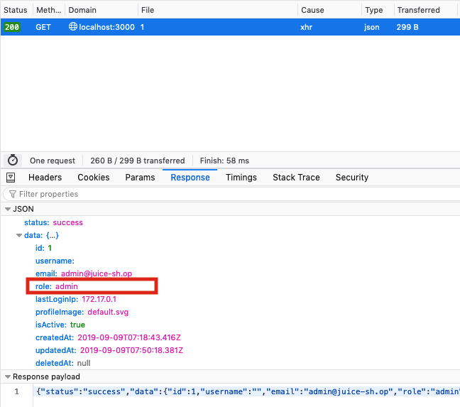
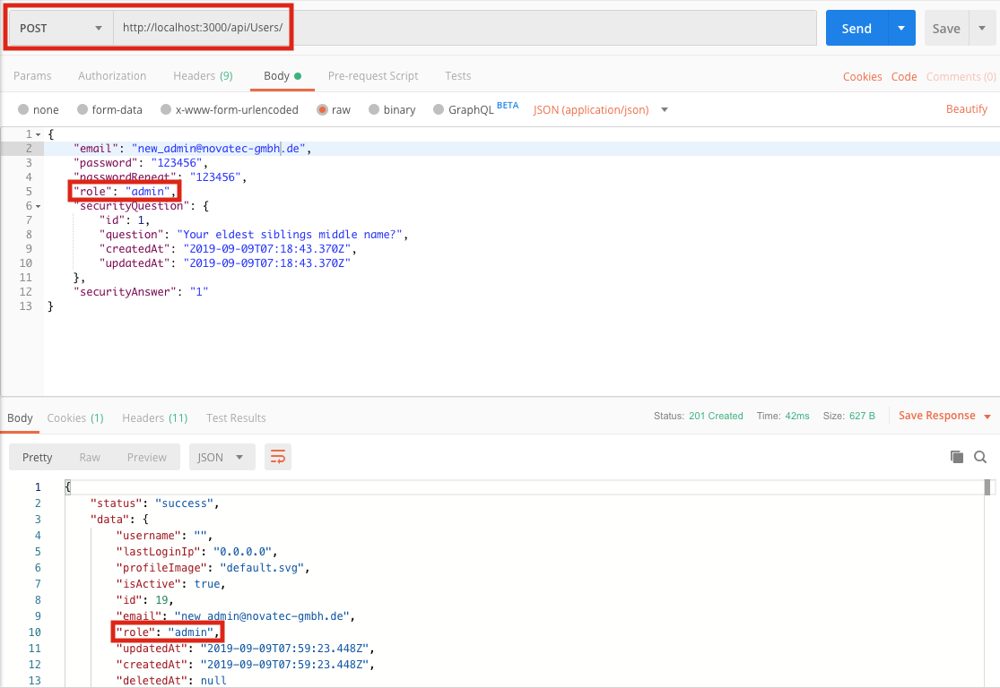
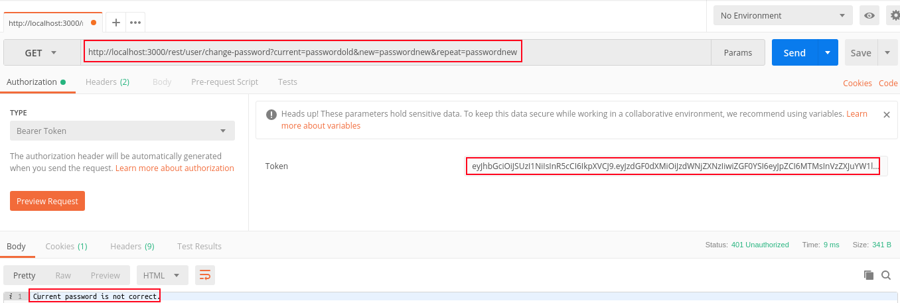

# Challenge Collection 2: Broken Authentication — Solutions

   * [Challenge 2.1: Brute-force attack](#challenge-21-brute-force-attack)
   * [Challenge 2.2: Create an administrator account](#challenge-22-create-an-administrator-account)
   * [Challenge 2.3: Take over the session of a previously logged in user](#challenge-23-take-over-the-session-of-a-previously-logged-in-user)
   * [Challenge 2.4: Change the password of the user account of Bender](#challenge-24-change-the-password-of-the-user-account-of-bender)
   * [Challenge 2.5: Log in with the user account of Bjoern](#challenge-25-log-in-with-the-user-account-of-bjoern)

## Challenge 2.1: Brute-force attack

[Install OWASP ZAP](https://github.com/zaproxy/zaproxy/wiki/Downloads).

Open **OWASP ZAP**. In the field `URL to attack`, fill in the URL of **OWASP Juice Shop** and click the `Launch Browser`-Button.  
  

In this browser, you go to http://localhost:3000/#/login and attempt a login with the email of the admin. Type `admin@juice-sh.op` in the email field, a random input in the password field and click the `Log in`-Button  
  

In this way, you cause a **POST** call on the **REST API**. Go back to **OWASP ZAP** and expand the `http://localhost:3000` folder in the `Sites` tab:  

  
You will see, that the last **POST** call is monitored there. Right click the **POST** call and choose `Attack` --> `Fuzz...`:  
  

In the window `Fuzzer`, mark the password (in this case `123`) that you have chosen for your login attempt as this is the parameter that should be replaced. In the area `Fuzz Locations:`, click on `Add...`:  
  

In the window `payloads`, click again on `Add...`:  
  

In the window `Add Payload`, change the `Type` to file, click at `Select...` and choose a word list from your local drive:  
  

For example, you can get the file `darkweb2017-top10000` from https://github.com/danielmiessler/SecLists/tree/master/Passwords:  
  

After adding the file, you can see a preview of the words in your text file:  
  

Click on `Add` and confirm the `Payloads` window with `OK`.
Your `Fuzzer` window should look like this:  
  

Now, you are ready to click on `Start Fuzzer`.
While Fuzzering, you will receive lots of passwords that lead to the status `Unauthorized`:  
  

Sort after the column `Code` or `Reason` and you see a row with one `OK` result. The column `Payloads` presents the password for the email `admin@juice-sh.op`: `admin123`.  


## Challenge 2.2: Create an administrator account

Install [Postman](https://www.getpostman.com/apps).  

Log in with your own account or with the admins account (described in challenge [2.1](https://github.com/nt-ca-aqe/developer-security-training/tree/master/Challenges/Solutions/Challenge-2#challenge-21-brute-force-attack)).
Browse to http://localhost:3000/#/administration, open the console of the web development tool and click on any eye icon next to the emails.  
  
In the console, you will see the **GET** request `http://localhost:3000/api/Users/1` that reveals you an opportunity to interact with the **API**. Switch to tab `Response` to see the name of the parameters you have to pass:  
  
Open **Postman**. Fill in `http://localhost:3000/api/Users` (note, that you don't pass the id `1` in this case) as **POST** request. Switch to tab `Body` and choose `JSON (application/json)`. There, you have to fill in something like:
```json
{
    "email": "new_admin@novatec-gmbh.de",
    "password": "123456",
    "passwordRepeat": "123456",
    "role": "admin",
    "securityQuestion": {
        "id": 1,
        "question": "Your eldest siblings middle name?",
        "createdAt": "2019-09-09T07:18:43.370Z",
        "updatedAt": "2019-09-09T07:18:43.370Z"
    },
    "securityAnswer": "1"
}
```
After sending this **POST** request, your Postman window should look like this:  



## Challenge 2.3: Take over the session of a previously logged in user

Make sure that the option `Persist Logs` is ticked in the console of the web development tool. So, you can browse through the **OWASP Juice Shop** without the need of having the **Web Development Tool** open to capture the **GET** and **POST** requests.  
  

In this case, the admin account with the email `admin@juice-sh.op` is the previously logged in user. Log in with his credentials (described in challenge [2.1](https://github.com/nt-ca-aqe/developer-security-training/tree/master/Challenges/Solutions/Challenge-2#challenge-21-brute-force-attack)) and log out again.  
Log in with another account, for example your own account. In this case, the email of this account is `testuser@juice-sh.op`  
Open the `console` and extend a **GET** or **POST** request caused by the admin account. In this example, the **POST** call `http://localhost:3000/rest/user/login` has been expanded:  
  
In tab `Response`, the session token and is shown. Also, the row `umail` reveals that the **session token** belongs to the admin's account. Copy the **session token** and switch to tab `Storage` (**Firefox**) of the **Web Development Tool**:

  
As you can see at the top, the currently active session is `testuser@juice-sh.op`. Now expand the section `Cookies` and click on `http://localhost:3000`. In the row `token`, replace the content of the column `Value` with the previously copied session token and reload the browser.

  
As you now see at the top, the session of `admin@juice-sh.op` has been restored without using the user credentials.


## Challenge 2.4: Change the password of the user account of Bender
Log in with Bender's user account. Visiting the administration section of the juice shop (described in [Challenge 1.2](https://github.com/nt-ca-aqe/developer-security-training/tree/master/Challenges/Challenge-1#challenge-12-find-the-admin-page)) reveals his e-mail: `bender@juice-sh.op`. If you don't know the password, apply **SQL injection**.  
Browse to http://localhost:3000/#/change-password, fill the input fields with random strings (`New Password` and `Repeat New Password` of course must match) and click on `Change` while capturing the HTTP calls in the `console` of the **Web Development Tool**.  
  
In this case, the first field has been filled with `passwordold` and the other two fields has been filled with `passwordnew`. Also, `passwordnew` should be the new password after solving this challenge. The console shows this **GET** call:  
  
Copy the request `http://localhost:3000/rest/user/change-password?current=passwordold&new=passwordnew&repeat=passwordnew` and paste it in [Postman](https://www.getpostman.com/apps). Make sure that you also copy the token (tab `Cookies` of the **GET** call) and paste it in Postman in the `Token` input field:  
  
As excepted, this **GET** call shows `Current password is not correct.` as result. You have to test different variants. For example, you can try a **GET** call without the `repeat` parameter:  
  
This leads to the message `New and repeated password do not match.`  
In contrast, removing the `current` parameter will show all user information for Bender and brings the wanted effect.
  
Also, the given parameter value `passwordnew` becomes the new password for Bender.


## Challenge 2.5: Log in with the user account of Bjoern
Inspect the source code by opening the **Web Development Tool** and selecting tab `Debugger` (**Firefox**) or `Sources` (**Chrome**). Search after the keyword `OAuth` in the `main.js` file.  
  
Have a look at the functions for `login` and `save`. You see, that the password is generated both times in the same way: `btoa(n.email.split("").reverse().join(""))`.  
Researching the meaning of `btoa` will reveal that this method encodes a string in **base-64** (For example, read on https://www.w3schools.com/jsref/met_win_btoa.asp). In addition, a `reverse` function is performed on the e-mail. So, the password is created from the reversed e-mail of the user.  
Visiting the administration section of the juice shop (described in [Challenge 1.2](https://github.com/nt-ca-aqe/developer-security-training/tree/master/Challenges/Challenge-1#challenge-12-find-the-admin-page)) shows that `bjoern.kimminich@googlemail.com` is the e-mail of Bjoern.  
By decoding the string `moc.liamelgoog@hcinimmik.nreojb` on `http://decodebase64.com/` reveals the password: `bW9jLmxpYW1lbGdvb2dAaGNpbmltbWlrLm5yZW9qYg==`  
  

