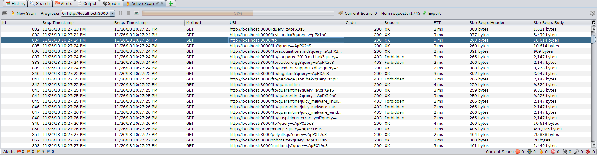

# Challenge Collection 4: Sensitive Data Exposure — Solutions

   * [Challenge 4.1: Find and open a confidential document](#challenge-42-find-and-open-a-confidential-document)
      * [Variant 1: Scanning the Juice Shop with OWASP ZAP](#variant-1-scanning-the-juice-shop-with-owasp-zap)
      * [Variant 2: Searching after security lacks in the user interface of the Juice Shop](#variant-2-searching-after-security-lacks-in-the-user-interface-of-the-juice-shop)

## Challenge 4.1: Find and open a confidential document

### Variant 1: Scanning the Juice Shop with OWASP ZAP

Start [OWASP ZAP](https://github.com/zaproxy/zaproxy/wiki/Downloads), fill in `http://localhost:3000` in the `Quick Start` tab and click on `Attack`
  

The scan shows you an area of the **OWASP Juice Shop** you have never seen before: `http://localhost:3000/ftp`
  

Visit this site:
  
Open `acquisitions-md` to solve the challenge.

### Variant 2: Searching after security lacks in the user interface of the Juice Shop

Browse to the `About Us` section of the **OWASP Juice Shop**: http://localhost:3000/#/about  
You will see that there is a more or less hidden link:
  

If you hover over the link, the `ftp` section will be revealed.

