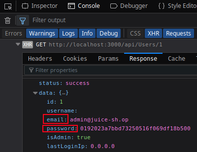
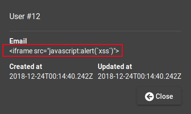
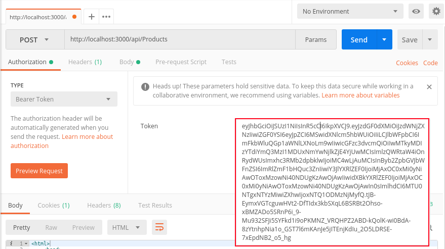
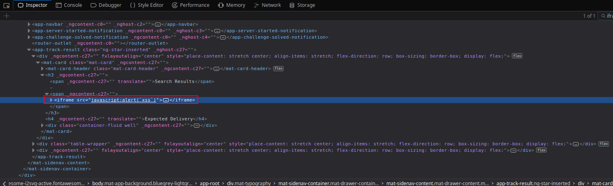

# Challenge Collection 5: Cross-Site scripting (XSS) — Solutions

* [Challenge 5.1: Persisted XSS with Postman](#challenge-51-persisted-xss-with-postman)
* [Challenge 5.2: Persisted XSS with Postman (2)](#challenge-52-persisted-xss-with-postman-2)
* [Challenge 5.3: Persisted XSS through the UI](#challenge-53-persisted-xss-through-the-ui)
* [Challenge 5.4: Reflected XSS](#challenge-54-reflected-xss)
* [Challenge 5.5: DOM XSS](#challenge-55-dom-xss)

## Challenge 5.1: Persisted XSS with Postman
For [Postman](https://www.getpostman.com/apps), you need to find out how to interact with the **users API**. Log in with your own account or with the administrator's account (described in [Challenge 3.1](https://github.com/nt-ca-aqe/thesis-ahs/tree/master/Challenges/Challenge%203:%20Injection#challenge-31-log-in-as-administrator)).  
By navigating to the **admin section** `http://localhost:3000/#/administration`, you will see the list of all users.
  
Open the tab `console` of the **Web Development Tool** of your browser. Afterwards, click on the eye icon of any user to open the **user's information**. You will recognize a **GET** call in the console:  
  
The **GET** call `http://localhost:3000/api/Users/1` reveals that you can interact with the **API** by sending a request to `http://localhost:3000/api/Users`. In addition, the tab `Response` of the **GET** call shows you several parameters, that belong to the user object.  
You have to create a new user entry by submitting a **body** with an **email** and a **password**, as these attributes are needed for a valid user. Fill in the input fields in **Postman** as shown here:  
  
Consider that you have to escape the `"` character in the body. So, the submitted body is <code>{"email": "<iframe src=\"javascript:alert(&grave;xss&grave;)\"/>", "password": "xss"}</code>. Make sure you choose `JSON(application/json)` and send this as a **POST** request to `http://localhost:3000/api/Users`. The request leads to a success and shows the body of the new user.  
Refresh the admin section:
  
You see that a dialog with the content `xss` pops out. Also, you see a new empty line in the user list with the iframe element. Clicking on the eye icon of this new line opens the user information:  

  
There, you see the submitted email: <code><iframe src="javascript:alert(&grave;xss&grave;)"/></code>.  

Checking the tab `Inspector` will show you that the iframe element has become a part of the HTML code:
  

## Challenge 5.2: Persisted XSS with Postman (2)
[Challenge 1.6](https://github.com/nt-ca-aqe/thesis-ahs/tree/master/Challenges/Challenge%201:%20Broken%20Access%20Control#challenge-16-change-the-description-of-the-product-owasp-ssl-advanced-forensic-tool-o-saft) has shown you that you have the opportunity to interact with the **products API** via `http://localhost:3000/api/Products`. Also, browsing to this URL shows you the following information:
  
To create a new product, you have to fill the parameters `name`, `description` and `price` with values.  
Before, you need to obtain the **session token** by logging in the application with any account and extracting the information from any **GET** call. To show the **GET** call, open the **Web Development Tool**, choose the tab `console` and switch to tab `Cookies` of the **GET** call:  

  

After copying the **session token**, you can start **Postman**. Insert the token:

  
Then, send a **POST** request to `http://localhost:3000/api/Products` with <code>{"name": "XSS", "description": "<iframe src=\"javascript:alert(&grave;xss&grave;)\"/>", "price": 10.50}</code> as body. Make sure that you escape the `"` character and that you choose `JSON(application/json)`:

  
The request leads to a success. Go to the product list of the **OWASP Juice Shop**. By switching to the site, that contains the new product, you will see a dialog with the content `xss` popping out:

  
Also, you will recognize a new line with the name `XSS`, an empty iframe as description and the price `10.50`. If you click on the eye icon of this empty line, you will see the following result:

  
While opening the product info, the dialog with the content `xss` pops out again.

## Challenge 5.3: Persisted XSS through the UI
Browse to `http://localhost:3000/#/contact`. You need to modify the **iframe element**, as the common input <code><iframe src="javascript:alert(&grave;xss&grave;)"/></code> wouldn't be parsed in the HTML code as you need. Instead, type in the following: <code><<iframe src="src"/>iframe src="javascript:alert(&grave;xss&grave;)"/></code>  
  
Submit the comment and browse to the `About us` section: `http://localhost:3000/#/about`  
  
The **administration section** will show you the same result: `http://localhost:3000/#/administration`  
  

## Challenge 5.4: Reflected XSS
Browse to `http://localhost:3000/#/track-order`. Type in <code><iframe src="javascript:alert(&grave;xss&grave;)"></code>.
  
Submit your input:  
  
The dialog with the content `xss` pops out. In addition, you see the **iframe element** in the background as **search result**.  
In the tab `Inspector` (**Firefox**) or `Elements` (**Chrome**) of the **Web Development Tool**, you will see that the iframe element with the JavaScript function has become a part of the HTML sources:  
  

## Challenge 5.5: DOM XSS
Fill the input field for the product search with <code><iframe src="javascript:alert(&grave;xss&grave;)"></code> and submit this request:  
  
The dialog with the content `xss` pops out. In addition, you see the **iframe element** in the background as search result.  

